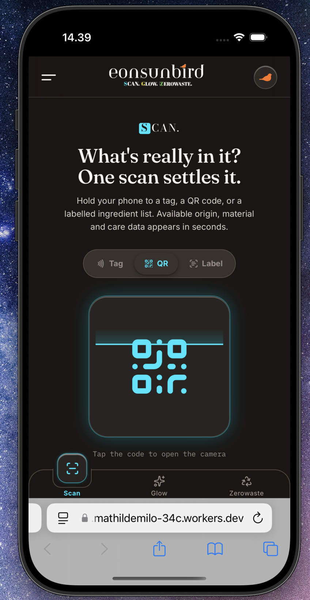
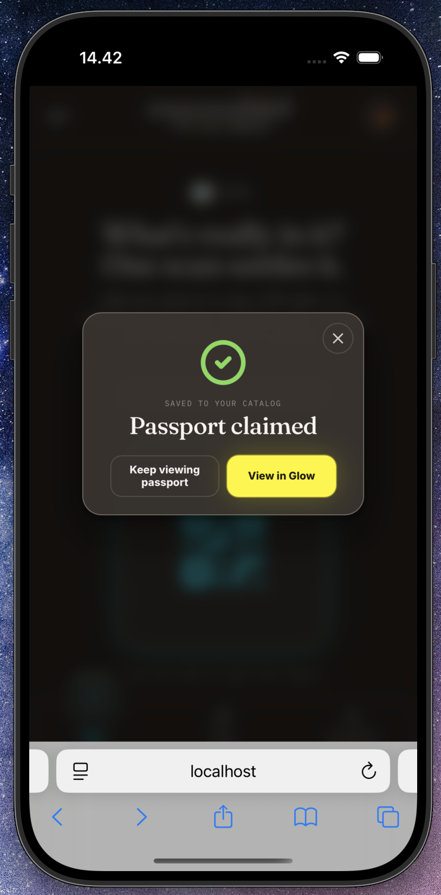
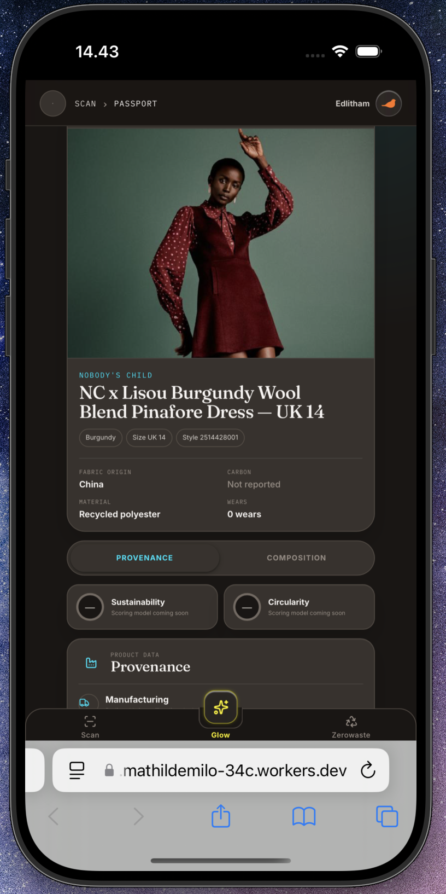

# Eonsunbird Web App – Technical Case

This repository is a technical case based on my work on Eonsunbird, an ongoing project exploring how Digital Product Passports can be made more accessible and useful for consumers.

The case focuses on the technical work I have contributed across the web app, product scan flow, API integration, product data handling and public-facing website.

The full Eonsunbird application and internal project code are not included in this repository. Instead, this repository contains simplified examples, technical documentation and selected screenshots that demonstrate the architecture, data flow and implementation approach.

## Technologies

- React
- TypeScript
- REST APIs
- Cloudflare Workers
- Cloudflare D1
- Git/GitHub
- QR/GTIN-based product lookup

## My Role

I am responsible for the technical development of the Eonsunbird project.

My work includes:

- Developing the web app in React and TypeScript
- Building the QR/GTIN-based product scan flow
- Connecting the frontend to product data through APIs
- Structuring and handling product data
- Deploying the application, API and catalogue using Cloudflare Workers and D1
- Debugging issues across data lookup, frontend behaviour and API connectivity
- Developing the public-facing Eonsunbird website

The project is still under development and has not been publicly launched.

## Case Overview

This repository contains a simplified technical case based on my work on the Eonsunbird web app.

### Documentation

- [Architecture overview](docs/architecture.md)
- [Product scan flow](docs/scan-flow.md)

## Simplified Code Examples

This repository also contains small, simplified examples based on the technical patterns used in the Eonsunbird web app.

- [GTIN parser](examples/gtin-parser.ts)
- [Product API client](examples/product-api-client.ts)
- [Example product data](examples/product-data-example.json)

These examples are rewritten for this case and are not copied directly from the production codebase.

### Screenshots

#### Scan screen

#### Authenticated product

#### Product Passport

## What this case demonstrates

- React and TypeScript development
- API integration
- QR/GTIN-based product lookup
- Structured product data handling
- Cloudflare Workers and D1
- Deployment and debugging across frontend, API and data flow

## Scope

Eonsunbird is still under development and has not been publicly launched.

This repository is a technical showcase and does not contain the full application, internal business logic, private endpoints, credentials or internal product data.
